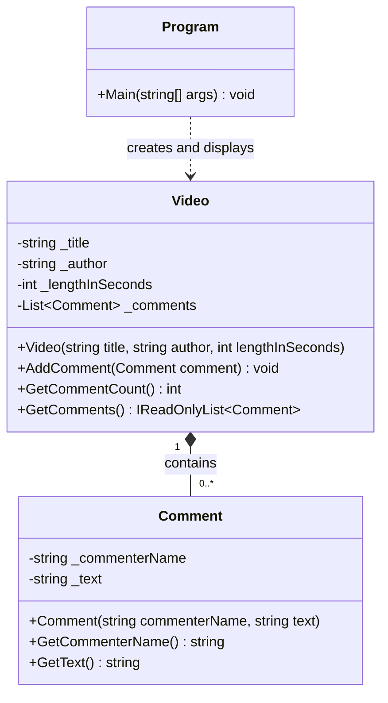
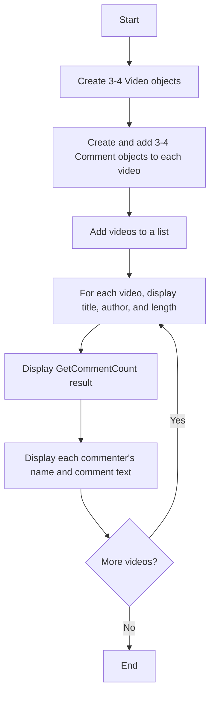
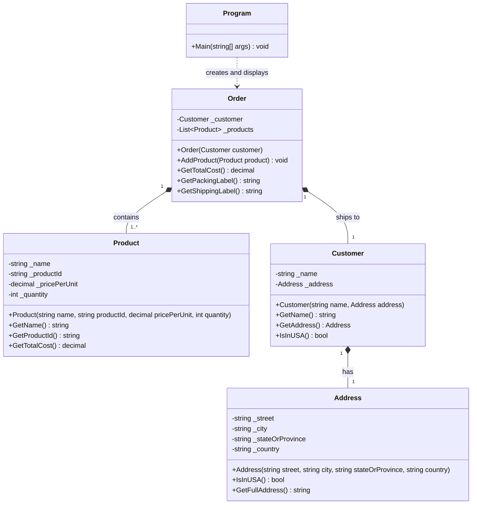
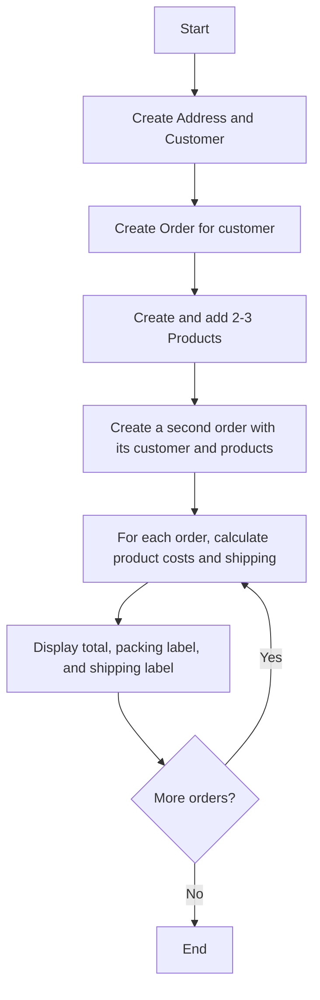

# Week 04 Foundation Programs Design

## Program 1: YouTube Videos (Abstraction)

### Purpose

Store information about several YouTube videos and their comments, then display each video's details, comment count, and comments. The program uses sample data; it does not connect to YouTube or request input.

### Classes and Responsibilities

| Class | Responsibility |
| --- | --- |
| `Video` | Hold a video's title, author, length in seconds, and comments. Add comments and report how many it contains. |
| `Comment` | Hold the name of the commenter and the text of one comment. |
| `Program` | Create 3-4 videos with 3-4 comments each, collect the videos, and display each video's information and comments. |

### Class Diagram

### Program Flow

## Program 2: Online Ordering (Encapsulation)

### Purpose

Represent customer orders and calculate each order's total, including shipping. For each order, display a packing label listing products and a shipping label showing the customer's name and address. The program uses sample data and does not request input.

### Classes and Responsibilities

| Class | Responsibility |
| --- | --- |
| `Product` | Encapsulate a product's name, product ID, unit price, and quantity; calculate its line total. |
| `Address` | Encapsulate street, city, state/province, and country; format the address and determine whether it is in the USA. |
| `Customer` | Encapsulate the customer's name and `Address`; report whether the customer lives in the USA by asking the address. |
| `Order` | Hold one customer and a list of products; calculate product totals plus one shipping charge, and create packing and shipping labels. |
| `Program` | Create at least two orders, each with 2-3 products, and display the total and both labels for each order. |

### Class Diagram

### Rules and Program Flow

- A product line total is `price per unit * quantity`.
- The order total is the sum of product line totals plus one shipping charge: `$5` when the customer's address is in the USA, otherwise `$35`.
- The packing label lists every product's name and product ID.
- The shipping label lists the customer's name and full address.
- Keep member fields private; expose only the constructors and methods needed to build orders and request their results.

